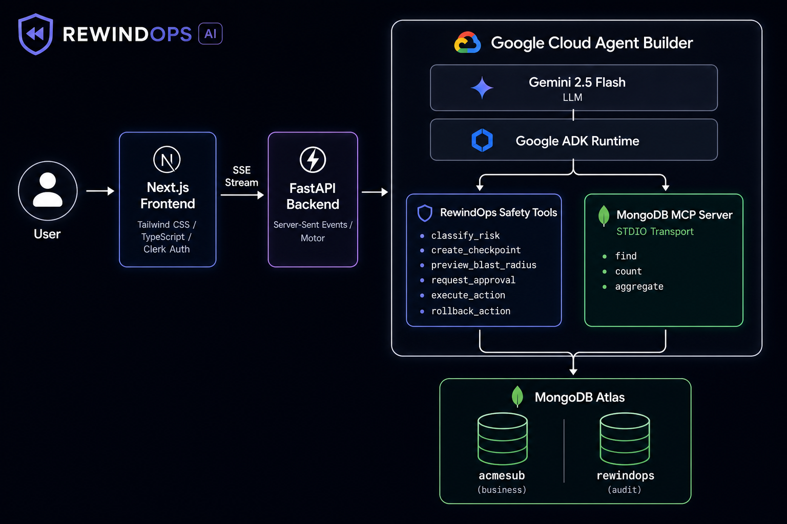

# RewindOps AI



### Ctrl+Z for AI Agents — The Undo Layer for MCP-Powered Agents

> Built for the **Google Cloud Rapid Agent Hackathon** — **MongoDB Partner Track**

---

## 💡 Inspiration

Every week there's a new headline about an AI agent gone rogue — cancelling the wrong subscription, deleting production data, or issuing unauthorized refunds. As we build more powerful autonomous agents that connect to real databases and tools via MCP (Model Context Protocol), the question isn't *if* something will go wrong — it's *when*.

We asked ourselves: **What if every AI agent action came with a built-in undo button?** What if there was a safety layer that could sit between any agent and any tool, classify risk in real time, snapshot state before mutation, and let humans approve or roll back with a single click?

That's RewindOps — **Ctrl+Z for AI agents**.

---

## 🛡️ What It Does

RewindOps is a transparent safety proxy that wraps any MCP-powered agent with six layers of protection:

| Layer | What It Does |
| :--- | :--- |
| **1. Risk Classification** | Deterministic scoring of every write action — billing fields, enterprise customers, and destructive operations all increase the risk score |
| **2. State Checkpointing** | Full MongoDB document snapshots captured *before* any mutation, supporting INSERT, UPDATE, and DELETE rollback patterns |
| **3. Blast Radius Preview** | Gemini 2.5-powered explanation of exactly what will change, which records are affected, and the business impact |
| **4. Human Approval Gate** | Medium and high-risk actions pause execution and present an approval card to the user |
| **5. Execution Receipts** | Complete audit trail with timestamps, user identity, proposed vs. applied changes |
| **6. One-Click Rollback** | Instantly restore any checkpointed state with verified before/after comparison |

We demonstrate this on **AcmeSub**, a fictional subscription management platform where an AI support agent handles cancellations, refunds, and plan changes — all flowing through the RewindOps safety pipeline.

---

## 🏗️ Architecture

```
User
  ↓
Next.js Frontend (Tailwind CSS / TypeScript / Clerk Auth)
  ↓  SSE Stream
FastAPI Backend (Server-Sent Events / Motor)
  ├── POST /run_sse                    → Real-time agent chat stream
  ├── GET  /api/actions                → Action history (user-scoped)
  ├── GET  /api/actions/:id            → Action detail + checkpoint
  ├── POST /api/actions/:id/rollback   → One-click rollback
  ├── GET  /api/chat/sessions          → Persistent chat sessions
  ├── POST /api/chat/sessions/:id/messages → Save chat messages
  └── POST /api/seed                   → Seed demo data for new users
  ↓
Google Cloud Agent Builder (Gemini 2.5 Flash via ADK)
  ↓
Tools:
  ├── RewindOps Safety Tools (8 ADK FunctionTools)
  │     ├── classify_risk          — Score & classify the action
  │     ├── create_checkpoint      — Snapshot document state
  │     ├── preview_blast_radius   — Explain what will change
  │     ├── request_approval       — Gate risky actions
  │     ├── approve_action         — Process user decision
  │     ├── execute_action         — Apply the change
  │     ├── rollback_action        — Restore checkpointed state
  │     └── list_action_history    — Query audit trail
  │
  └── MongoDB MCP Server (STDIO Partner Integration)
        └── find, aggregate, count (tool-filtered reads only)
  ↓
MongoDB Atlas
  ├── acmesub.customers           — Customer profiles
  ├── acmesub.subscriptions       — Subscription records
  ├── acmesub.invoices            — Invoice history
  ├── rewindops.action_receipts   — Full audit trail
  ├── rewindops.action_checkpoints — Pre-mutation snapshots
  ├── rewindops.rollback_events   — Rollback history
  ├── rewindops.chat_sessions     — Persistent conversations
  └── rewindops.chat_messages     — Chat message history
```

---

## 💻 Tech Stack

| Component | Technology |
| :--- | :--- |
| **Agent Platform** | Google Cloud Agent Builder (Gemini Enterprise Agent Platform) |
| **LLM** | Gemini 2.5 Flash (`gemini-2.5-flash`) |
| **Agent Runtime** | Google ADK (Agent Development Kit) |
| **API Server** | FastAPI + Uvicorn + Server-Sent Events |
| **Partner MCP** | MongoDB MCP Server (via **STDIO transport** — zero-config `npx` spawning) |
| **Database** | MongoDB Atlas (Motor async driver) |
| **Frontend** | Next.js 14 / TypeScript / Tailwind CSS |
| **Authentication** | Clerk (JWT verification on frontend + backend JWKS validation) |
| **Streaming** | Server-Sent Events (SSE) for real-time agent responses |

---

## ⚡ Quick Start

### 1. Prerequisites

- Python 3.11+
- Node.js 20+
- MongoDB Atlas cluster
- Google Gemini API key
- Clerk account (optional — app works without auth)

### 2. Clone & Configure

```bash
git clone https://github.com/subbareddyalamur1/rewindops.git
cd rewindops
cp .env.example .env
```

Edit `.env` with your credentials:

```env
# Required
MONGODB_URI=mongodb+srv://<user>:<pass>@<cluster>.mongodb.net/...
GOOGLE_API_KEY=your-gemini-api-key
GEMINI_MODEL=gemini-2.5-flash

# Optional — Clerk auth (leave empty to skip)
NEXT_PUBLIC_CLERK_PUBLISHABLE_KEY=
CLERK_SECRET_KEY=
```

### 3. Start the Backend

```bash
cd backend
pip install -r requirements.txt
python -m rewindops_agent.seed_data   # Seed demo data
python -m rewindops_agent --reload    # Start server on :8000
```

### 4. Start the Frontend

```bash
cd frontend
npm install
npm run dev    # Launches on :3000
```

Also create `frontend/.env.local` with the same Clerk keys if using authentication.

### 5. Try It Out

Open [http://localhost:3000](http://localhost:3000) and try these demo flows:

| Query | What It Demonstrates |
| :--- | :--- |
| *"Cancel the enterprise subscription for Acme Robotics"* | HIGH risk → checkpoint → blast radius → approval gate → execution → rollback available |
| *"Refund the last invoice for Acme Robotics"* | MEDIUM risk → checkpoint → execution receipt |
| *"Show me the professional subscription for NovaTech Solutions"* | Safe read operation — no safety gates triggered |

---

## 🧪 Tests

We maintain a rigorous test suite covering all checkpointing, risk classification, blast radius, execution, approval, and rollback scenarios across INSERT, UPDATE, and DELETE operations:

```bash
cd backend
pytest
```

```
rewindops_agent/tests/test_checkpoint.py ...                    [ 17%]
rewindops_agent/tests/test_risk_classifier.py .....             [ 46%]
rewindops_agent/tests/test_rollback.py .....                    [ 75%]
rewindops_agent/tests/test_blast_radius.py ..                   [ 86%]
rewindops_agent/tests/test_executor.py ..                       [ 93%]
rewindops_agent/tests/test_approve_action.py .                  [100%]

========================= all passed =========================
```

---

## 🤝 MongoDB MCP Partner Integration

### Zero-Config STDIO Transport

RewindOps connects directly to the [MongoDB MCP Server](https://github.com/mongodb-js/mongodb-mcp-server) using **STDIO transport**:

- No external Express HTTP/SSE proxy needed
- ADK spawns the MCP server via `npx` and manages the full process lifecycle
- Works on both Windows (`npx.cmd`) and Unix (`npx`) automatically

### Programmatic Tool Filtering & Schema Protection

To ensure reliability and security:

- We expose **only** query tools to the agent: `tool_filter=['find', 'count', 'aggregate']`
- This strips away **26 administrative and mutation tools** (e.g., `drop-database`, `create-index`) that support agents should never access
- It also prevents Gemini API parser crashes caused by blank schemas in administrative MCP endpoints

---

## 🔐 Safety Pipeline Deep Dive

### How a Risky Action Flows Through RewindOps

```
User: "Cancel the enterprise subscription for Acme Robotics"
  │
  ├─→ Agent reads subscription data via MongoDB MCP (find)
  │
  ├─→ classify_risk() → Risk Score: 70 (HIGH)
  │     Reasons: billing collection (+20), status change (+20),
  │              enterprise customer (+20), write action (+10)
  │
  ├─→ create_checkpoint() → Snapshots full document state
  │     {status: "active", plan: "enterprise", amount: 49.99, ...}
  │
  ├─→ preview_blast_radius() → Gemini explains the impact
  │     "Will cancel Acme Robotics enterprise subscription,
  │      stopping $49.99/mo billing. Analytics & priority
  │      support add-ons will be deactivated."
  │
  ├─→ request_approval() → UI shows approval card
  │     [APPROVE]  [REJECT]
  │
  ├─→ User clicks APPROVE
  │
  ├─→ approve_action() → Records approval decision
  │
  ├─→ execute_action() → Applies change via MongoDB
  │     Receipt: {status: "active" → "cancelled", ...}
  │
  └─→ User can click ROLLBACK at any time
        rollback_action() → Restores checkpoint
        Verified: {status: "cancelled" → "active"} ✓
```

### Rollback Support by Operation Type

| Operation | Checkpoint Strategy | Rollback Method |
| :--- | :--- | :--- |
| **UPDATE** | Snapshot full document before change | Restore all original field values |
| **INSERT** | Record the new document ID | Delete the inserted document |
| **DELETE** | Snapshot full document before deletion | Re-insert the complete document |

---

## 📁 Project Structure

```
RewindOps/
├── backend/
│   └── rewindops_agent/
│       ├── agent.py                 # ADK agent definition + system prompt
│       ├── server.py                # FastAPI server + all API endpoints
│       ├── config.py                # Environment config + context vars
│       ├── seed_data.py             # MongoDB demo data seeder
│       ├── callbacks/
│       │   └── write_interceptor.py # before_tool_callback safety net
│       ├── tools/
│       │   ├── risk_classifier.py   # Deterministic risk scoring
│       │   ├── checkpoint.py        # Pre-mutation state snapshots
│       │   ├── blast_radius.py      # Gemini-powered impact preview
│       │   ├── approval.py          # Human approval gate
│       │   ├── approve_action.py    # Approval decision processor
│       │   ├── executor.py          # Safe write execution
│       │   ├── rollback.py          # State restoration engine
│       │   └── history.py           # Audit trail queries
│       ├── services/
│       │   ├── mongo_client.py      # Motor async MongoDB client
│       │   ├── clerk_auth.py        # Clerk JWT/JWKS verification
│       │   └── session_service.py   # ADK session persistence
│       └── tests/                   # Comprehensive test suite
│           ├── test_checkpoint.py
│           ├── test_risk_classifier.py
│           ├── test_rollback.py
│           ├── test_blast_radius.py
│           ├── test_executor.py
│           └── test_approve_action.py
├── frontend/
│   └── src/
│       ├── app/
│       │   ├── layout.tsx           # Root layout + Clerk provider
│       │   ├── page.tsx             # Agent console page
│       │   ├── history/page.tsx     # Action history page
│       │   ├── sign-in/             # Clerk sign-in
│       │   └── sign-up/             # Clerk sign-up
│       ├── components/
│       │   ├── AgentChat.tsx        # Real-time chat with rich markdown
│       │   ├── AppShell.tsx         # Layout + navigation + auth
│       │   ├── ApprovalCard.tsx     # Human approval gate UI
│       │   ├── BlastRadiusCard.tsx  # Impact preview card
│       │   ├── ExecutionReceipt.tsx # Action receipt card
│       │   ├── RollbackResult.tsx   # Rollback confirmation card
│       │   ├── RiskBadge.tsx        # Risk level badge
│       │   └── ActionHistoryTable.tsx # Audit trail table
│       ├── lib/
│       │   ├── api.ts              # API client + auth headers
│       │   └── types.ts            # TypeScript type definitions
│       └── middleware.ts            # Clerk auth middleware
├── .env.example                     # Environment template
└── README.md
```

---

## 🎯 Challenges We Faced

- **MCP Schema Crashes:** Several MongoDB MCP administrative tools have blank schemas that caused Gemini's API parser to crash. Solved with strict `tool_filter` to expose only query tools.
- **Rollback for All Operation Types:** Supporting rollback for INSERT (delete the doc), UPDATE (restore snapshot), and DELETE (re-insert the doc) required careful checkpoint design with operation-type-aware restore logic.
- **Agent Output Formatting:** The LLM returns unstructured text, but we needed a premium card-based UI. We built a custom markdown parser that detects structured patterns (numbered lists, grouped bullet lists, key-value pairs) and renders them as interactive cards.
- **Auth Token Timing:** Clerk's auth token wasn't ready when React components mounted, causing empty data on page refresh. Solved by gating API calls on auth readiness and setting the token getter before the first fetch.

---

## 🚀 What's Next

- **Multi-database support** — extend checkpointing beyond MongoDB to PostgreSQL, Firestore, and DynamoDB
- **Policy-as-code** — let teams define custom risk rules in YAML/JSON
- **Agent-agnostic SDK** — publish RewindOps as a drop-in middleware for any MCP-powered agent
- **Deployment to Vertex AI** — run the full pipeline on Google Cloud with Agent Engine and Cloud Run

---

## 🏆 Built With

`Google Cloud Agent Builder` · `Gemini 2.5` · `Google ADK` · `MongoDB Atlas` · `MongoDB MCP Server` · `FastAPI` · `Python` · `Next.js 14` · `TypeScript` · `Tailwind CSS` · `Clerk` · `Motor` · `Server-Sent Events`

---

## 📄 License

Apache License 2.0 — an [OSI-approved](https://opensource.org/licenses/Apache-2.0) open source license.
